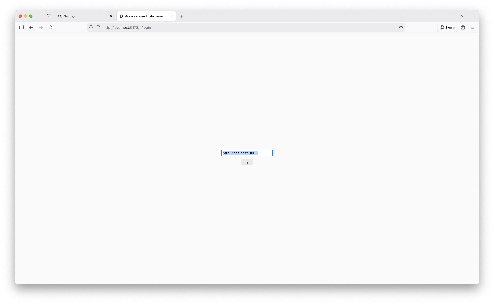
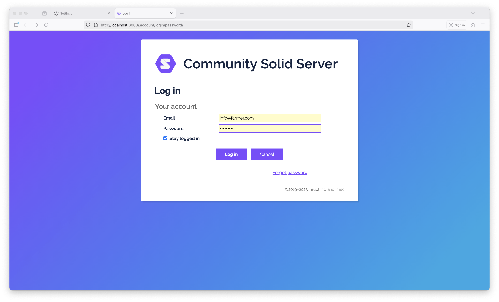
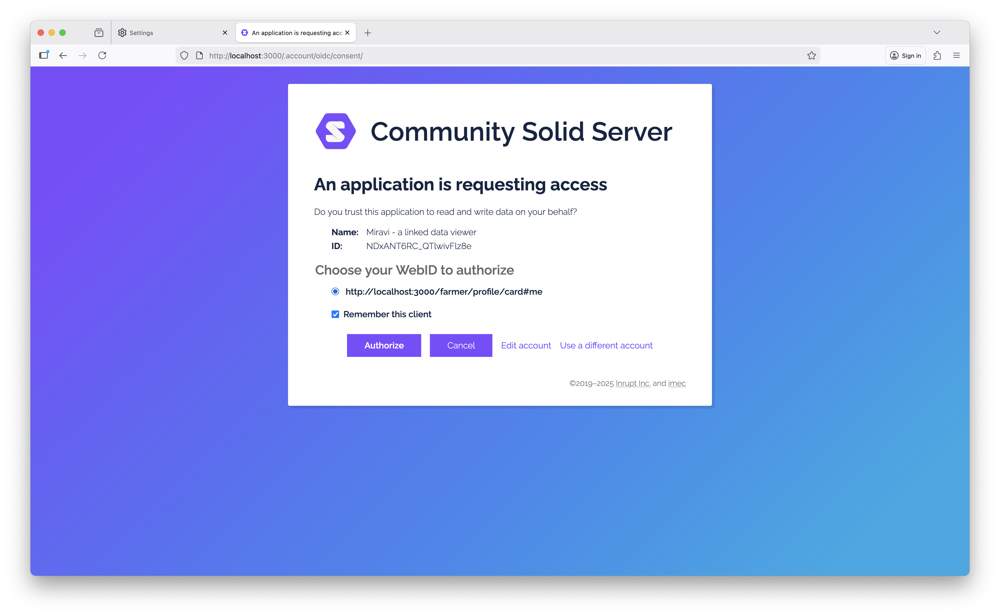
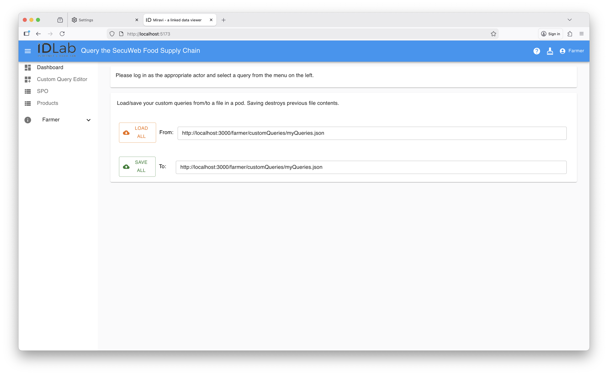
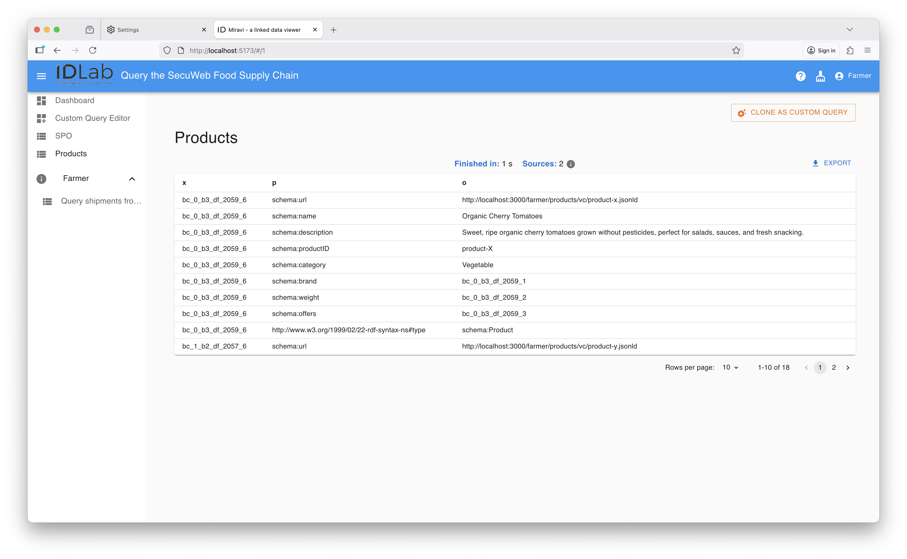
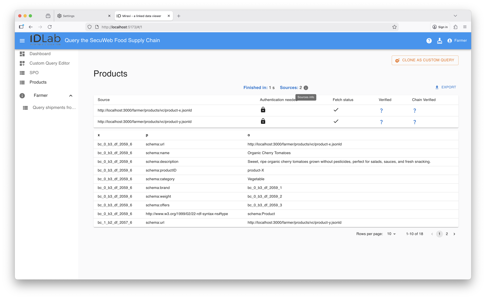
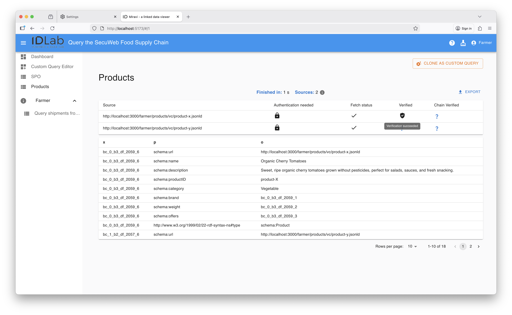
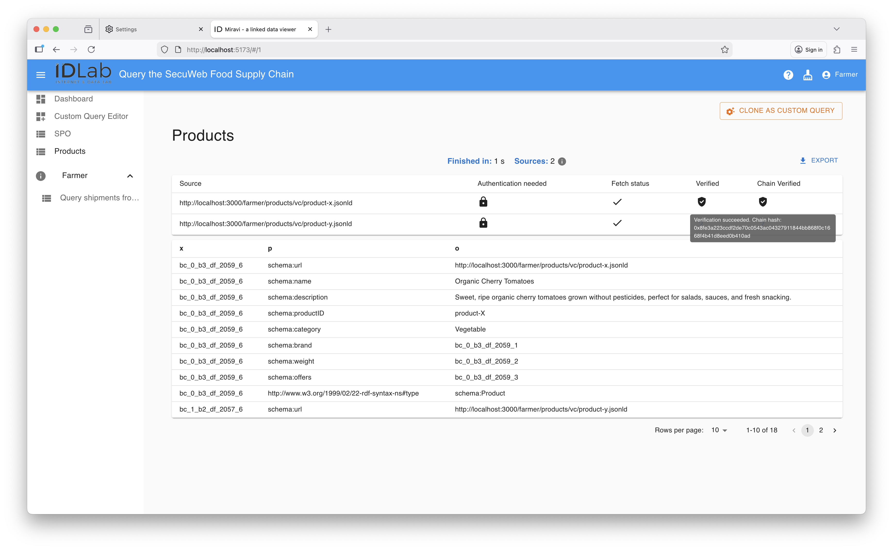

<!-- omit in toc -->
# SecuWeb Demonstrator: Food Supply Chain


---
Table of Contents
- [Introduction](#introduction)
- [Technical Overview](#technical-overview)
- [Prerequisites](#prerequisites)
- [Instructions](#instructions)
- [Using Miravi](#using-miravi)
  - [Authenticated as Farmer](#authenticated-as-farmer)
- [License](#license)

## Introduction

This PoC demonstrates a platform that enables controlled, permission-based data
sharing using Solid protocols, combined with guaranteed data immutability
through a Blockchain.
As a result, organisations to share data in a granular, standards-based
way (via Solid Pods) while ensuring that the integrity and history of that data
is cryptographically secured on a distributed ledger.

We apply this platform to a food supply chain use case, where the
ability to trace products with both fine-grained access controls and
tamper-proof records can substantially improve processes such as food recalls.
Each actor in a food supply chain—farmers, processors, transporters,
retailers—stores their operational data in their own Solid Pod. Key events
(e.g., harvest, processing batch, shipment) are anchored on the blockchain.
Downstream actors can access only the specific data
they are permitted to see, while regulators or auditors can trust the immutable
ledger trail to verify the chain of custody during a recall or safety
investigation.


## Technical Overview

This repository glues to together five main components:

1. Solid Pods (hosted on a [Community Solid Server (CSS)](https://github.com/CommunitySolidServer/CommunitySolidServer))
2. A Blockchain development environment for anchoring Decentralized Identifiers (DIDs) and Verifiable Credentials (VCs) (submodule: [`secuweb-anchors`](./secuweb-anchors/))
3. A Verifiable Credentials service (submodule: `vc`) that handles setup, issuance, verification of VCs.
4. Linked Data Viewer ([Miravi](https://github.com/SolidLabResearch/miravi-a-linked-data-viewer))
5. The use case flows (see [`src/flows`](src/flows/))

## Prerequisites

- nvm
- npx

## Instructions

Pull submodules.

```bash
 git submodule update --init --recursive --remote
```

Install.

```bash
npm i
```

Setup and start Miravi.

```bash
# CLI A
source env-localhost
./scripts/setup/finalize-setup.sh
cd ../food-supply-chain-miravi/main
npm i
npm run dev
```

> [!NOTE]
> Miravi's configuration can be found [here](./actors/viewer/setup/config.json.template).

Spin up a clean CSS.

```bash
# Terminal B
# At repository root
rm -rf css/root
npm run pod
```

Start the Hardhat node.

```bash
# Terminal C
cd secuweb-anchors
nvm use
npm i
npx hardhat node
```

Redeploy contract and at least one event (in this case: registering a DID).
Then, start the verifier service.

```bash
# Terminal D
cd secuweb-anchors
npm run setup
npm run server # start verifier service
```

Run flow.

```bash
# Terminal E
# At repository root
# Install vc submodule
cd vc
npm i
npm run build
cd ..
# Create each actor's VCs and store them on their pod
./src/flows/load-actor-data-into-solid-pods.sh
# Anchor each actor's VC on the chain
./src/flows/register-products-and-shipments.sh
```

Explore chain transactions.

```bash
# Terminal F
npm run explore
```

## Using Miravi

Navigate to the data viewer (Miravi) using <http://localhost:5173>.

### Authenticated as Farmer

Click on the profile button, then "Login". 


Enter the URL of the Solid Server: <http://localhost:3000> and click on "Login".



Enter the Farmer's credentials (`info@farmer.com`, `farmer123`) and click "Log in".



Click "Authorize" so that Miravi can access data on the Farmer's Solid Pod.



You will arrive at the following landing page:



The **Products**-view (in left panel) shows product details.

]

Source information can be viewed by clicking on the information-icon on top of the table with product detials.



The source information shows the data sources that were queried in the selected view.<br>
Moreover, the source information panel shows the following properties for each queried data source:

- *Authentication needed*: Whether the data source is public, or authentication was needed.
- *Fetch status*: Indicates whether data retrieval was successful or not.
- *Verified*: Indicates whether the data source's digital signature is valid. Clicking the question mark initiates this data integrity check, showing whether or not it was successful.
    
- *Chain Verified*: Indicates whether the data source's anchored hash (i.e., the hash on the blockchain) matches the locally computed hash. Clicking the question mark initiates this data integrity check, showing whether or not it was successful. In case of succes, the data source's on-chain hash is shown.
    

## License

This code is copyrighted by [Ghent University – imec](http://idlab.ugent.be/)
and released under the [MIT license](http://opensource.org/licenses/MIT).
