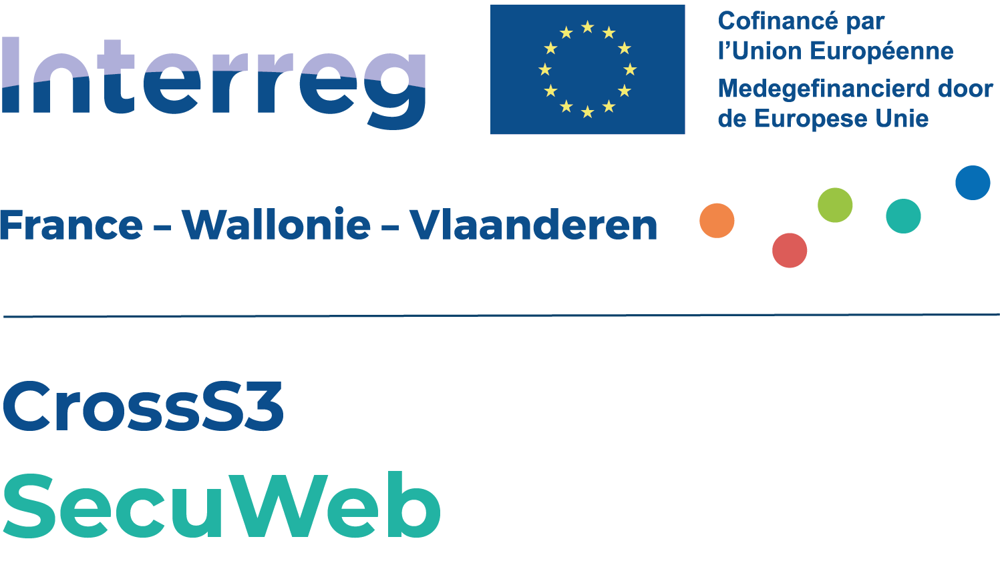
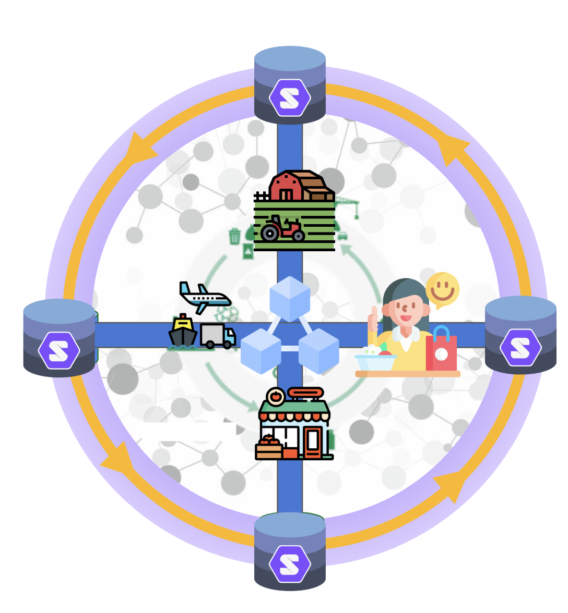

<!-- omit in toc -->
# SecuWeb Demonstrator: Food Supply Chain



---
Table of Contents
- [Introduction](#introduction)
- [Technical Overview](#technical-overview)
- [Instructions](#instructions)
- [License](#license)

## Introduction

This PoC demonstrates a platform that enables controlled, permission-based data
sharing using Solid protocols, combined with guaranteed data immutability
through a Blockchain.
As a result, organisations to share data in a granular, standards-based
way (via Solid Pods) while ensuring that the integrity and history of that data
is cryptographically secured on a distributed ledger.

We apply this platform to a food supply chain use case, where the
ability to trace products with both fine-grained access controls and
tamper-proof records can substantially improve processes such as food recalls.
Each actor in a food supply chain—farmers, processors, transporters,
retailers—stores their operational data in their own Solid Pod. Key events
(e.g., harvest, processing batch, shipment) are anchored on the blockchain.
Downstream actors can access only the specific data
they are permitted to see, while regulators or auditors can trust the immutable
ledger trail to verify the chain of custody during a recall or safety
investigation.



## Technical Overview

This repository glues to together five main components:

1. Solid Pods (hosted on a [Community Solid Server (CSS)](https://github.com/CommunitySolidServer/CommunitySolidServer))
2. A Blockchain development environment for anchoring Decentralized Identifiers (DIDs) and Verifiable Credentials (VCs) (submodule: [`secuweb-anchors`](./secuweb-anchors/))
3. A Verifiable Credentials service (submodule: `vc`) that handles setup, issuance, verification of VCs.
4. Linked Data Viewer ([Miravi](https://github.com/SolidLabResearch/miravi-a-linked-data-viewer))
5. The use case flows (see [`src/flows`](src/flows/))

## Instructions

Install.

```bash
# CLI A
npm i
```

Setup and start Miravi.

```bash
# CLI B
npm i
source env-localhost
./scripts/setup/finalize-setup.sh
cd ../food-use-case-miravi/main
npm run dev
```

> [!NOTE]
> Miravi's configuration can be found [here](./actors/viewer/setup/config.json.template).

Spin up a clean CSS.

```bash
# Terminal C
# At repository root
rm -rf css/root
npm run pod
```

Start the Hardhat node.

```bash
# Terminal D
cd secuweb-anchors
npm i
npx hardhat node
```

Redeploy contract and at least one event (in this case: registering a DID).
Then, start the verifier service.

```bash
# Terminal E
cd secuweb-anchors
npm run redeploy
npm run register
npm run server # start verifier service
```

Run flow.

```bash
# Terminal F
# At repository root
# Create each actor's VCs and store them on their pod
./src/flows/load-actor-data-into-solid-pods.sh
# Anchor each actor's VC on the chain
./src/flows/register-products-and-shipments.sh
```

Explore chain transactions.

```bash
# Terminal G
cd secuweb-anchors
npm run explore
```

Navigate to the data viewer (Miravi) using <http://localhost:5173>.

## License

This code is copyrighted by [Ghent University – imec](http://idlab.ugent.be/)
and released under the [MIT license](http://opensource.org/licenses/MIT).
