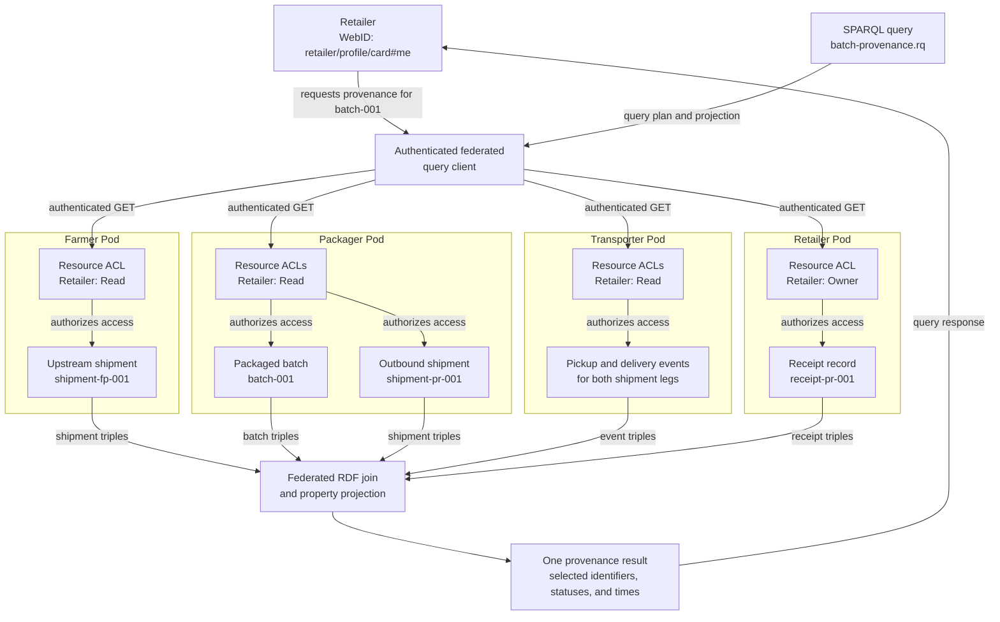

# Scenario P: Federated Queryability

This folder contains self-contained development examples for Scenario P:
Interoperability x Queryability.

## Scenario

Given a packaged product batch, a Retailer issues one logical query to
reconstruct selected transportation provenance from authorized resources
distributed across independently controlled actor Pods. Shared identifiers and
interoperable RDF relations allow shipment, transport-event, and receipt facts
to be joined without relying on a centralized data store or actor-specific
APIs.

The example focuses on query interoperability. Resource discovery, credential
signing, and blockchain anchoring are separate concerns and are intentionally
not required here.

## What the example demonstrates

The answer for `did:secuweb:packager:batch-001` is decentralized:

| Pod | Domain data used by the query |
| --- | --- |
| Farmer | The upstream shipment from Farmer to Packager |
| Packager | The packaged batch and outbound shipment to Retailer |
| Transporter | Pickup and delivery events for both shipment legs |
| Retailer | The receipt of the outbound shipment |

No individual Pod contains the complete expected answer. The query succeeds
only when an authenticated Retailer can read and join the required resources
from all four Pods.

## Data flow



The query client uses the Retailer's authenticated fetch for every request.
Each Pod evaluates its own resource ACL before returning RDF data. The client
then joins the authorized triples through `prov:wasDerivedFrom`,
`ex:productID`, `ex:shipmentID`, and `prov:used`, and projects only the fields
declared in the SPARQL `SELECT` clause.

## Folder structure

```text
dev/scenario-p/
├── README.md
├── expected/
│   └── batch-provenance.srj
├── query/
│   └── batch-provenance.rq
└── pods/
    ├── farmer/
    │   └── shipments/out/
    ├── packager/
    │   ├── products/
    │   └── shipments/out/
    ├── transporter/
    │   └── events/
    └── retailer/
        └── receipts/
```

Each domain resource has an adjacent `.acl` file. For example:

```text
shipment-fp-001.jsonld
shipment-fp-001.jsonld.acl
```

The `pods/` hierarchy mirrors the intended paths below
`http://localhost:3000/`.

## Resource inventory

| Local example | Intended resource URL |
| --- | --- |
| `pods/farmer/shipments/out/shipment-fp-001.jsonld` | `http://localhost:3000/farmer/shipments/out/shipment-fp-001.jsonld` |
| `pods/packager/products/batch-001.jsonld` | `http://localhost:3000/packager/products/batch-001.jsonld` |
| `pods/packager/shipments/out/shipment-pr-001.jsonld` | `http://localhost:3000/packager/shipments/out/shipment-pr-001.jsonld` |
| `pods/transporter/events/pickup-fp-001.jsonld` | `http://localhost:3000/transporter/events/pickup-fp-001.jsonld` |
| `pods/transporter/events/delivery-fp-001.jsonld` | `http://localhost:3000/transporter/events/delivery-fp-001.jsonld` |
| `pods/transporter/events/pickup-pr-001.jsonld` | `http://localhost:3000/transporter/events/pickup-pr-001.jsonld` |
| `pods/transporter/events/delivery-pr-001.jsonld` | `http://localhost:3000/transporter/events/delivery-pr-001.jsonld` |
| `pods/retailer/receipts/receipt-pr-001.jsonld` | `http://localhost:3000/retailer/receipts/receipt-pr-001.jsonld` |

`fp` identifies the Farmer-to-Packager shipment leg. `pr` identifies the
Packager-to-Retailer shipment leg.

## Linked-data model

The resources use stable identifiers to form joins across Pod boundaries:

| Relation | Meaning |
| --- | --- |
| `prov:wasDerivedFrom` | Links the packaged batch to the upstream Farmer shipment |
| `ex:productID` | Links the outbound Packager shipment to the packaged batch |
| `ex:shipmentID` | Links each Transporter event to its shipment |
| `prov:used` | Links the Retailer receipt to the outbound shipment |

References are represented as JSON-LD `@id` objects. They therefore expand to
RDF IRIs rather than plain string literals.

The domain records contain more fields than the query returns, including
quantities, actors, locations, and temperatures. This allows the query to
demonstrate property selection in addition to cross-Pod joins.

## Access-control model

The ACL examples use the W3C Web Access Control vocabulary.

- Each data owner has `acl:Read`, `acl:Write`, and `acl:Control` access to its
  resource.
- The Retailer WebID has `acl:Read` access to every non-Retailer resource
  required by the federated query.
- The Retailer owns its receipt resource.
- No public read authorization is defined.
- No other actor receives access merely because it participates in the supply
  chain.

The requesting identity is:

```text
http://localhost:3000/retailer/profile/card#me
```

The effective access matrix is:

| Resource owner | Owner access | Retailer access |
| --- | --- | --- |
| Farmer | Read, Write, Control | Read |
| Packager | Read, Write, Control | Read |
| Transporter | Read, Write, Control | Read |
| Retailer | Read, Write, Control | Owner |

The ACLs are deliberately resource-specific. A successful query therefore
does not imply that the Retailer can browse or read all data in another
actor's Pod.

## Federated query

[`query/batch-provenance.rq`](query/batch-provenance.rq) is one logical SPARQL
query evaluated over all eight resources.

The query:

1. starts with `did:secuweb:packager:batch-001`;
2. follows `prov:wasDerivedFrom` to the Farmer shipment;
3. reads the Farmer shipment status and finds the Packager shipment carrying
   the batch;
4. joins pickup and delivery events for both shipment legs;
5. joins the Retailer's receipt; and
6. returns only shipment identifiers, shipment and event statuses, and
   relevant timestamps.

The source set is intentionally explicit in this example:

```text
http://localhost:3000/farmer/shipments/out/shipment-fp-001.jsonld
http://localhost:3000/packager/products/batch-001.jsonld
http://localhost:3000/packager/shipments/out/shipment-pr-001.jsonld
http://localhost:3000/transporter/events/pickup-fp-001.jsonld
http://localhost:3000/transporter/events/delivery-fp-001.jsonld
http://localhost:3000/transporter/events/pickup-pr-001.jsonld
http://localhost:3000/transporter/events/delivery-pr-001.jsonld
http://localhost:3000/retailer/receipts/receipt-pr-001.jsonld
```

Source discovery is excluded so that this example tests Scenario P rather than
Scenario R.

## Using the examples

These files are development fixtures; they are not loaded by the demonstrator
setup automatically.

To execute the example:

1. Create or use the Farmer, Packager, Transporter, and Retailer accounts on a
   Solid server.
2. Upload each JSON-LD document to the intended URL listed above.
3. Apply the adjacent ACL document to that resource.
4. Authenticate the query client as the Retailer.
5. Evaluate `query/batch-provenance.rq` with the eight resource URLs as the
   federated source set and the authenticated fetch implementation.
6. Compare the bindings with
   [`expected/batch-provenance.srj`](expected/batch-provenance.srj).

A Comunica-style invocation has the following shape:

```javascript
const bindingsStream = await queryEngine.queryBindings(query, {
  sources,
  fetch: retailerAuthenticatedFetch,
  lenient: true,
});
```

The important behavior is that `fetch` authenticates as the Retailer for every
Pod request. A public fetch should not retrieve the protected resources.

## Expected result

The expected output is stored as a SPARQL 1.1 Query Results JSON document in
[`expected/batch-provenance.srj`](expected/batch-provenance.srj).

It contains one reconstructed provenance path:

- batch: `did:secuweb:packager:batch-001`;
- upstream shipment: `did:secuweb:farmer:shipment-fp-001`;
- outbound shipment: `did:secuweb:packager:shipment-pr-001`;
- both shipment records have status `shipped`;
- both pickup and delivery statuses for both shipment legs; and
- the Retailer's receipt status and timestamp.

Quantities, temperatures, endpoints, and other non-requested properties are
not projected by the query.

## Evaluation criteria

The Scenario P example passes when:

- an authenticated Retailer obtains the expected single result binding;
- the result requires resources from all four actor Pods;
- removing any mandatory resource prevents reconstruction of the complete
  result;
- a public or unauthorized client cannot obtain the protected source data;
- returned identifiers link records across organizational boundaries;
- the query returns only its declared projection; and
- the same SPARQL query is used across all sources without actor-specific API
  operations.

This is distinct from Scenario O, which should query multiple resources within
one actor's Pod. Scenario P specifically requires a join across independently
controlled Pods.
