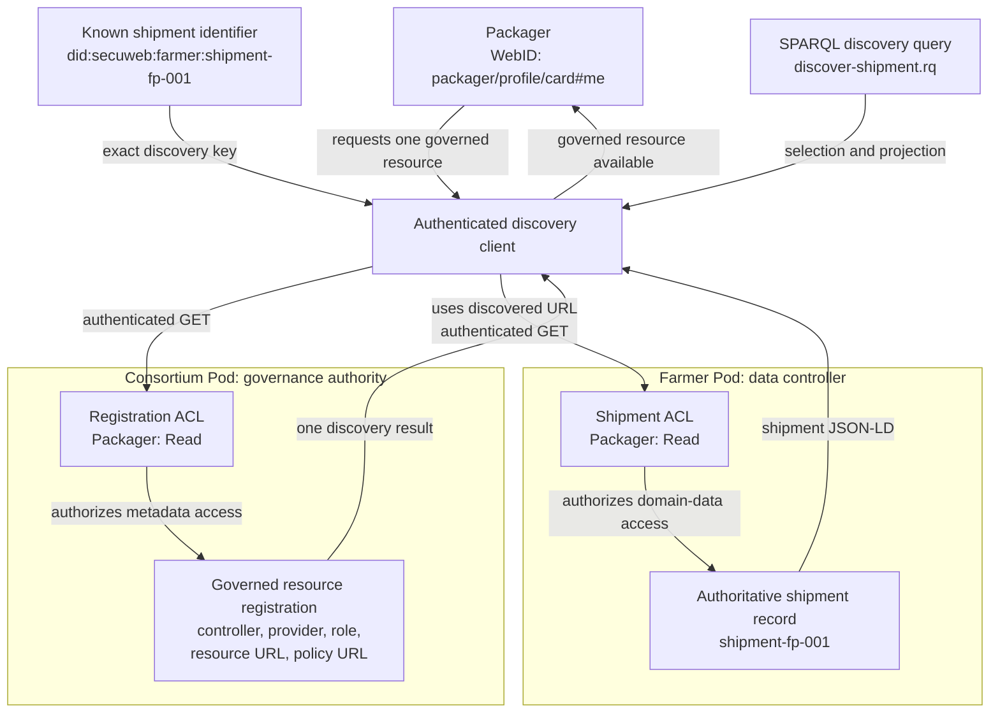

# Scenario Q: Governed Single-Resource Discoverability

This folder contains self-contained development examples for Scenario Q:
Data Governance x Discoverability.

## Scenario

A Packager expects a shipment from a Farmer and needs the corresponding
shipment record. Instead of receiving an undocumented URL or searching the
Farmer's Pod, the Packager consults a governance-controlled registration.
Using the shipment identifier and its role as shipment destination, the
Packager discovers one authoritative resource together with its controller,
responsible provider, resource type, intended role, and access-policy
reference.

The example focuses on discovering exactly one governed resource. Enumerating
all resources across the supply chain belongs to Scenario R.

## What the example demonstrates

The Packager starts with:

```text
did:secuweb:farmer:shipment-fp-001
```

The governance registration resolves that identifier to:

```text
http://localhost:3000/farmer/shipments/out/shipment-fp-001.jsonld
```

The discovery result also identifies:

| Governance metadata | Value |
| --- | --- |
| Resource type | `ex:ShipmentRecord` |
| Data controller | Farmer |
| Responsible provider | Farmer |
| Intended agent | Packager |
| Intended role | `ex:ShipmentDestination` |
| Governance status | `active` |
| Access policy | The shipment resource's ACL URL |

Discovering the location does not grant access. The Packager must separately
be authorized by the Farmer's resource ACL before retrieving the shipment.

## Data flow



The two authorization decisions are independent:

1. The Consortium permits the Packager to read the governance registration.
2. The Farmer permits the Packager to read the discovered shipment resource.

This separation makes the governance responsibility explicit. The Consortium
maintains the authoritative registration, while the Farmer remains the data
controller and enforces access to the domain data.

## Folder structure

```text
dev/scenario-q/
├── README.md
├── expected/
│   └── discover-shipment.srj
├── query/
│   └── discover-shipment.rq
└── pods/
    ├── consortium/
    │   └── governance/registrations/
    │       ├── shipment-fp-001.jsonld
    │       └── shipment-fp-001.jsonld.acl
    └── farmer/
        └── shipments/out/
            ├── shipment-fp-001.jsonld
            └── shipment-fp-001.jsonld.acl
```

The `pods/` hierarchy mirrors the intended paths below
`http://localhost:3000/`.

## Resource inventory

| Local example | Intended resource URL |
| --- | --- |
| `pods/consortium/governance/registrations/shipment-fp-001.jsonld` | `http://localhost:3000/consortium/governance/registrations/shipment-fp-001.jsonld` |
| `pods/farmer/shipments/out/shipment-fp-001.jsonld` | `http://localhost:3000/farmer/shipments/out/shipment-fp-001.jsonld` |

Each JSON-LD resource has an adjacent WAC ACL document.

## Governance registration

The Consortium registration is machine-readable JSON-LD. It connects the
known business identifier to the authoritative resource and records the
governance facts required to interpret that discovery result.

The registration contains:

- `schema:identifier` for the requested shipment;
- `ex:registeredResource` for the authoritative resource URL;
- `ex:resourceType` to describe the resource;
- `ex:dataController` to identify who controls the data;
- `ex:responsibleProvider` to identify who must provide the record;
- `ex:intendedAgent` and `ex:intendedRole` to explain why the Packager is a
  relevant participant;
- `ex:accessPolicy` to identify the policy governing domain-data access; and
- `ex:governanceStatus` to exclude inactive registrations.

The registration itself is not the shipment record. It is governance metadata
used to locate and interpret the record.

## Domain data

The Farmer shipment resource represents the Farmer-to-Packager shipment leg.
It contains the product, quantity, origin, destination, transporter, and
shipment status.

The `@id` of the shipment is:

```text
did:secuweb:farmer:shipment-fp-001
```

This matches the identifier in the governance registration.

## Access-control model

The ACL examples use the W3C Web Access Control vocabulary.

### Governance registration ACL

- The Consortium has `acl:Read`, `acl:Write`, and `acl:Control`.
- The Packager has `acl:Read`.
- No public authorization is present.

### Shipment resource ACL

- The Farmer has `acl:Read`, `acl:Write`, and `acl:Control`.
- The Packager has `acl:Read`.
- No public authorization is present.

The Packager identity is:

```text
http://localhost:3000/packager/profile/card#me
```

An anonymous client cannot discover the protected registration or retrieve
the protected shipment. An actor that can discover metadata still cannot read
the shipment unless the Farmer independently authorizes it.

## Discovery query

[`query/discover-shipment.rq`](query/discover-shipment.rq) is evaluated only
against the governance registration resource.

The query selects an active registration that matches:

- the exact shipment identifier; and
- the Packager WebID as intended agent.

It projects:

- the authoritative resource URL;
- resource type;
- data controller;
- responsible provider;
- intended role; and
- access-policy URL.

The query deliberately does not enumerate other registrations or traverse the
entire catalog. This confines the example to single-resource discovery.

## Using the examples

These files are development fixtures; they are not loaded automatically by
the demonstrator setup.

To execute the example:

1. Create or use Consortium, Farmer, and Packager accounts on a Solid server.
2. Upload the governance registration to:

   ```text
   http://localhost:3000/consortium/governance/registrations/shipment-fp-001.jsonld
   ```

3. Apply its adjacent ACL.
4. Upload the Farmer shipment to:

   ```text
   http://localhost:3000/farmer/shipments/out/shipment-fp-001.jsonld
   ```

5. Apply its adjacent ACL.
6. Authenticate the discovery client as the Packager.
7. Evaluate `query/discover-shipment.rq` using only the governance
   registration as source.
8. Compare the binding with
   [`expected/discover-shipment.srj`](expected/discover-shipment.srj).
9. Use the returned resource URL with the same authenticated Packager fetch to
   retrieve the Farmer shipment.

A Comunica-style discovery invocation has the following shape:

```javascript
const bindingsStream = await queryEngine.queryBindings(query, {
  sources: [
    "http://localhost:3000/consortium/governance/registrations/shipment-fp-001.jsonld",
  ],
  fetch: packagerAuthenticatedFetch,
});
```

## Expected result

The expected discovery output is a SPARQL 1.1 Query Results JSON document:

[`expected/discover-shipment.srj`](expected/discover-shipment.srj)

It contains exactly one binding for the Farmer shipment. The result includes
enough governance metadata to identify the authoritative resource and
understand the responsibility and policy context around it.

The expected result does not include the shipment's quantity, status, or
product. Those facts are obtained only after the Packager retrieves the
discovered domain resource under the Farmer's ACL.

## Evaluation criteria

The Scenario Q example passes when:

- an authenticated Packager can read the governance registration;
- the discovery query returns exactly one result;
- the result matches the requested shipment identifier;
- the result identifies the authoritative URL, resource type, controller,
  responsible provider, intended role, and access-policy URL;
- the Packager can retrieve the discovered shipment because the Farmer's ACL
  grants read access;
- an anonymous or unauthorized client cannot retrieve either protected
  resource;
- discovering the registration does not modify or bypass the Farmer's ACL;
  and
- no unrelated resource is returned.

This is distinct from Scenario R, which must discover the complete relevant
resource set across multiple actor Pods. Scenario Q stops after resolving one
specific governed resource and verifying that its separate access policy
remains effective.
