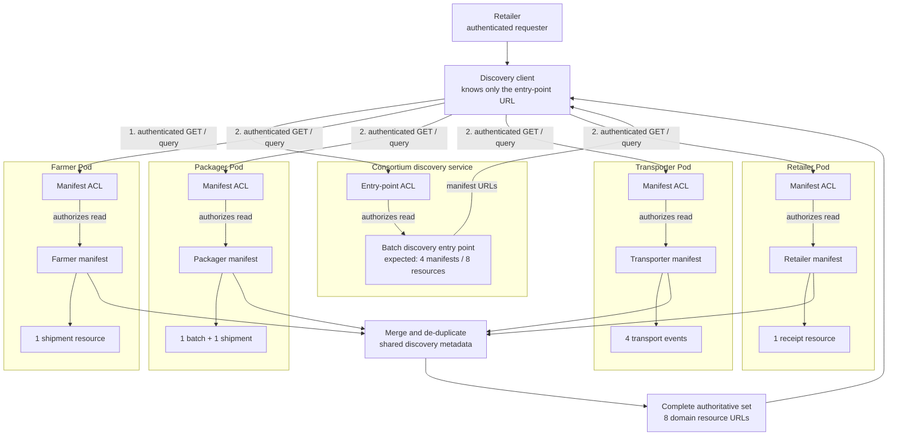
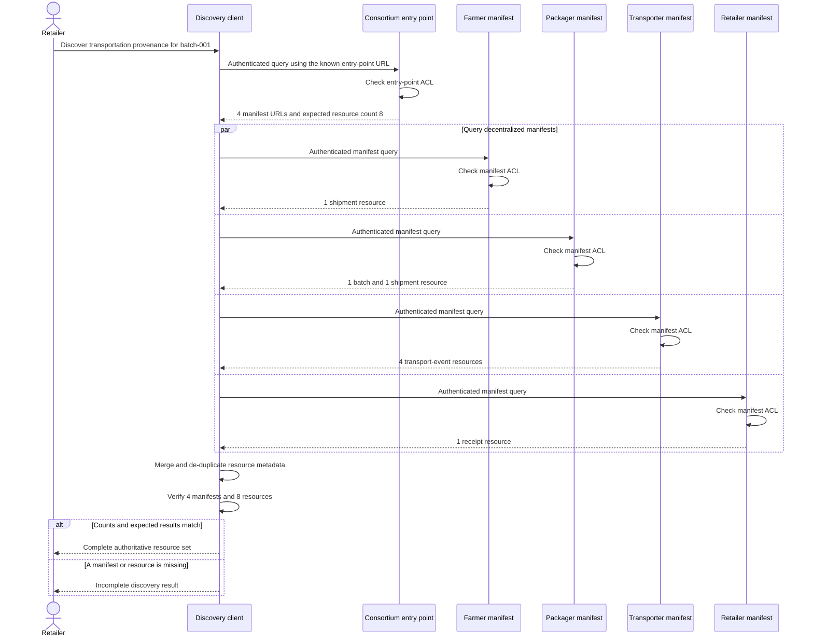

# Scenario R: Complete Distributed Resource Discoverability

## Scenario

Given the identifier of a packaged product batch and one known consortium
discovery entry point, an authenticated retailer discovers every registered
resource needed to reconstruct that batch's transportation provenance across
the Farmer, Packager, Transporter, and Retailer Pods.

Scenario R demonstrates **Data Interoperability x Discoverability**. The
participating Pods publish discovery metadata using the same RDF vocabulary,
so a client can combine their manifests into one consistently interpreted
resource set.

## Discovery Scope

For this example, "all resources" means the authoritative set of resources
registered for:

- batch `did:secuweb:packager:batch-001`;
- discovery scope `ex:TransportationProvenance`; and
- requester `http://localhost:3000/retailer/profile/card#me`.

The entry point declares that this scope contains four actor manifests and
eight domain resources. Those counts let the client detect an incomplete
discovery result without assuming that every confidential resource in every
Pod must be exposed.

## What This Example Demonstrates

1. The client starts with only the consortium entry-point URL.
2. The entry point identifies four decentralized actor manifests.
3. Each manifest uses the same terms to describe its registered resources.
4. The client merges the manifests into an authoritative set of eight resource
   URLs.
5. ACL checks apply independently to the entry point, manifests, and domain
   resources.

Unlike Scenario Q, which demonstrates discovery of one governed resource,
Scenario R demonstrates complete discovery of a distributed resource set.

## Data Flow



The final URLs can be fetched or queried as a separate step. Discovery does
not bypass each domain resource's adjacent ACL.

## Discovery Sequence



The client obtains the manifest URLs dynamically from the entry point. It does
not begin with a hard-coded list of actor manifests or domain resources.

## Directory Layout

```text
scenario-r/
├── README.md
├── expected/
│   ├── discover-manifests.srj
│   └── discover-resources.srj
├── pods/
│   ├── consortium/discovery/
│   │   ├── batch-001.jsonld
│   │   └── batch-001.jsonld.acl
│   ├── farmer/
│   │   ├── discovery/
│   │   └── shipments/out/
│   ├── packager/
│   │   ├── discovery/
│   │   ├── products/
│   │   └── shipments/out/
│   ├── retailer/
│   │   ├── discovery/
│   │   └── receipts/
│   └── transporter/
│       ├── discovery/
│       └── events/
└── query/
    ├── discover-manifests.rq
    └── discover-resources.rq
```

Every JSON-LD example has an adjacent `.acl` file.

## Discovery Metadata

The consortium entry point uses:

| Term | Meaning |
| --- | --- |
| `schema:identifier` | Product batch identifier |
| `ex:discoveryScope` | Type of resource set being discovered |
| `ex:intendedAgent` | Actor for whom the set is defined |
| `ex:manifest` | Link to an actor's resource manifest |
| `ex:expectedManifestCount` | Expected number of actor manifests |
| `ex:expectedResourceCount` | Expected number of domain resources |

Each actor manifest uses:

| Term | Meaning |
| --- | --- |
| `ex:dataController` | Actor responsible for the manifest |
| `ex:resourceEntry` | Structured description of one resource |
| `ex:resource` | Discoverable domain resource URL |
| `ex:resourceIdentifier` | Stable domain identifier |
| `ex:resourceType` | Semantically interoperable resource type |

## Authoritative Resource Set

| Pod | Registered resources | Count |
| --- | --- | ---: |
| Farmer | Outbound shipment from Farmer to Packager | 1 |
| Packager | Packaged batch and outbound shipment to Retailer | 2 |
| Transporter | Pickup and delivery events for both shipments | 4 |
| Retailer | Receipt of the packaged batch | 1 |
| **Total** |  | **8** |

## ACL Model

- The consortium entry point grants `acl:Read` to the Retailer.
- The Farmer, Packager, and Transporter manifests grant `acl:Read` to the
  Retailer while retaining owner control.
- The Retailer controls its own manifest.
- Every domain resource has a separate adjacent ACL.
- No example grants public access through `acl:agentClass foaf:Agent`.

This means successful metadata discovery is evidence of authorized
discoverability, not evidence that access control was skipped.

## Running the Example

These files are development fixtures and are not loaded automatically.

1. Upload the contents of `pods/` to matching paths on the local Solid server
   at `http://localhost:3000/`.
2. Authenticate as
   `http://localhost:3000/retailer/profile/card#me`.
3. Run `query/discover-manifests.rq` against only:

   `http://localhost:3000/consortium/discovery/batch-001.jsonld`

4. Use the four returned manifest URLs as the source set for
   `query/discover-resources.rq`. Do not supply a hard-coded list of domain
   resource URLs.
5. Compare the results with:

   - `expected/discover-manifests.srj`
   - `expected/discover-resources.srj`

6. Optionally fetch the eight discovered domain resources as the Retailer to
   confirm that their independent ACLs permit access.

## Evaluation Criteria

Scenario R passes when:

- the client begins with exactly one known discovery entry point;
- the authenticated Retailer can read that entry point;
- four distinct actor manifests are discovered;
- the manifests are the only sources used by the second discovery query;
- eight distinct domain resource URLs are discovered;
- the returned resource identifiers and types match the expected result;
- the observed counts match the entry point's declared counts;
- each discovered URL resolves to an existing protected resource; and
- removing or denying access to a required manifest produces a detectable
  incomplete result.

The query output and expected SPARQL Results JSON files provide evidence for
the evaluated manifest count, resource count, source distribution, stable
identifiers, and semantic resource types.
