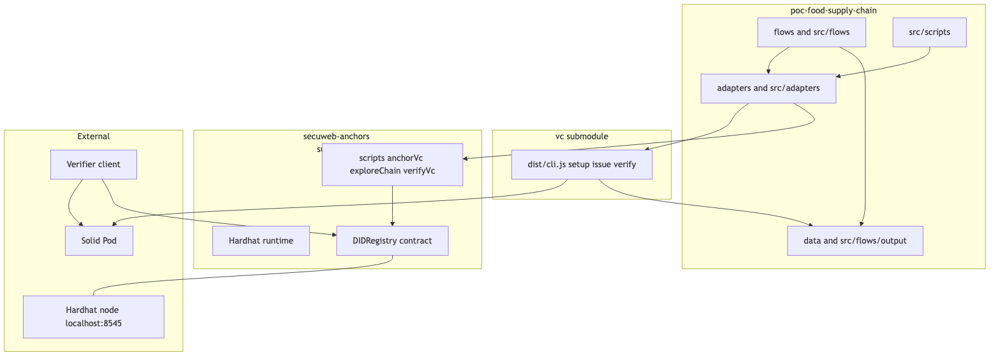

# Development

## High-level components

Orchestrator (`poc-food-supply-chain`)
- flows runs end-to-end shell flows (e.g., flow1.sh, flow1+anchor*.sh)
- adapters delegates to external tools (VC lib and hardhat scripts)
- scripts tiny helpers (anchor-one, anchor-all, verify-one, verify-all)
- data holds emitted VC files and flow outputs

VC submodule
- dist/cli.js handles setup, issuance, verification, and writes VC JSON-LD to Solid and disk

Anchoring submodule (`secuweb-anchors`)
- Hardhat runtime and scripts
- DIDRegistry smart contract storing VC hashes

External
- Solid Pod stores DID Doc, verificationMethod, and VCs
- Hardhat node local blockchain
- Verifier fetches VC from Solid and compares hash against on-chain anchor